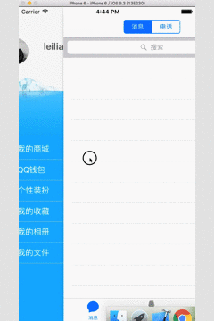

# PSDrawerManager

侧边栏是现在app中很常用的一种UI展示方式，这里我封装了QQ的侧边栏进行了一下较为简单的封装，使用起来很简单，接入方式如下：
```
// tabBarController
PSTabBarController *tabBarVC = [[PSTabBarController alloc] init];    
// 左侧视图
LeftView *leftView = [[LeftView alloc] initWithFrame:CGRectMake(-self.window.width * (1 - kLeftWidthScale), 0, self.window.width, self.window.height)];    
// 接入侧边栏
[[PSDrawerManager instance] installCenterViewController:tabBarVC leftView:leftView];
```

如果你想要像QQ中一样，只有在tabBar选中某一项的时候才能够展示侧边栏，那么你可以像这样调用:
```
#pragma mark -
#pragma mark - UITabBarController protocol methods
- (void)tabBarController:(UITabBarController *)tabBarController didSelectViewController:(UIViewController *)viewController {
    if ([viewController isKindOfClass:[UINavigationController class]]) {
        UINavigationController *navigationController = (UINavigationController *)viewController;
        UIViewController *_viewController = navigationController.viewControllers.firstObject;        
        if ([_viewController isKindOfClass:[MessageViewController class]]) {
// 启动手势响应
            [[PSDrawerManager instance] beginDragResponse];
        } else {
// 取消手势响应
            [[PSDrawerManager instance] cancelDragResponse];
        }
    }
}
```

如果你想要点击侧边栏中列表的某一项，自动回到主控制器你可以这样：
```
- (void)tableView:(UITableView *)tableView didSelectRowAtIndexPath:(NSIndexPath *)indexPath {
    // 回到中间控制器
    [[PSDrawerManager instance] resetShowType:PSDrawerManagerShowCenter];
// 在这里进行页面跳转
//    [navigationController pushViewController:viewController animated:YES];
}
```

只需要这几行代码就可以接入侧边栏，另外还提供了一些接口，大家可以查看"PSDrawerManager"文件，.h接口如下:
```
/** 设置中心控制器及左侧视图
 * @param centerViewController: 中心控制器
 * @param leftView: 左侧视图
 */
- (void)installCenterViewController:(UIViewController *)centerViewController leftView:(UIView *)leftView;

// 隐藏侧边阴影
- (void)hiddenShadow;

// 显示侧边阴影
- (void)showShadow;

// 开启拖拽响应
- (void)beginDragResponse;

// 取消拖拽响应
- (void)cancelDragResponse;

/** 设置显示状态
 * @param showType: 枚举类型 PSDrawerManagerShowType
 */
- (void)resetShowType:(PSDrawerManagerShowType)showType;
```

Demo展示：



如果对你有帮助的话，请给个star奥 😊 !!!
谢谢大家 !!!